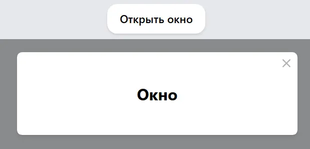

# React Modal Window

 

    
    

 

Простое приложение на React для демонстрации модального окна.

## Технологии и библиотеки

- **React** 
- **Create React App** 
- **Sass** 
- **@testing-library/react**, **@testing-library/jest-dom**, **@testing-library/user-event** 

## Структура проекта

- App.js — основной компонент приложения и модального окна
- index.js — точка входа приложения
- index.scss — стили приложения
- index.html — HTML-шаблон

## Скрипты

- `npm start` — запуск приложения в режиме разработки
- `npm run build` — сборка приложения для продакшена
- `npm test` — запуск тестов
